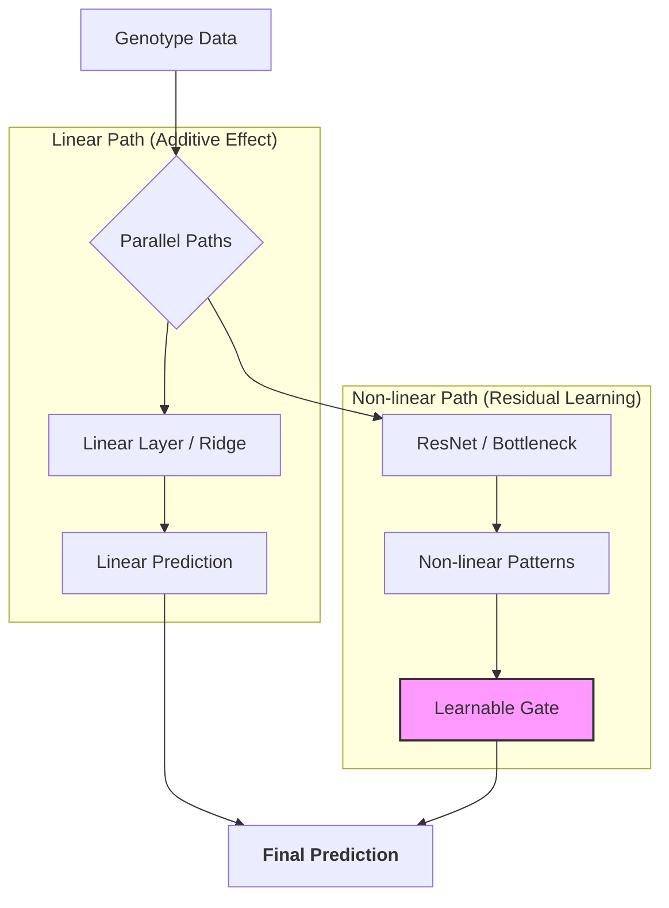

# Genomic-Prediction-ResNet-Hybrid
This is a personal research project focused on deep learning applications in genomic prediction.

## 予測フローの概要



従来のゲノミック予測の線形モデル（GBLUP）と深層学習（ResNet）を統合し、大豆（SoyNAM）のゲノムデータから収量予測を行うハイブリッド・フレームワークです。

## 概要

本プロジェクトは、線形モデルである **MT-GBLUP (Multi-Trait Genomic Best Linear Unbiased Prediction)** が捉えきれない、遺伝子間の非線形な相互作用（エピスタシス等）を **ResNet (Residual Network)** で抽出することを目指しています。

統計的な厳密さと深層学習の柔軟性を組み合わせることで、従来の限界を超える予測精度の達成をターゲットとしています。


## 特徴

- **Hybrid Architecture**: `sommer` (R) による線形推定と、`PyTorch` (Python) による残差補正を組み合わせた二段階予測。
- **Optimized ResNet**: ゲノムデータの高次元特性に対応するため、勾配消失を防ぐスキップ接続、GELU活性化関数、BatchNormを採用。
- **Rigorous Validation**: 10-fold Cross-Validationを50回反復し、統計的有意差（Paired t-test）を検証。
- **W&B Integration**: Weights & Biasesによるリアルタイムな学習ログの監視と、ハイパーパラメータのトレーサビリティを確保。

## プロジェクト構成

```text
genomic-prediction-resnet-hybrid/
├── data/               # SoyNAM公開表現型・遺伝型データ
│   ├── NAM03/          # High yield in drought
│   ├── NAM24/          # High yielding
│   └── NAM40/          # Diverse ancestry
├── processed_data/     # preprocess.py によって生成される統合済み行列
├── preprocess.py       # 複数家系の統合・数値化・メモリ最適化スクリプト
├── train.py            # Hybrid ResNet の学習・検証スクリプト
├── environment.yml     # Conda環境再現用ファイル
└── LICENSE             # MIT License
```
# セットアップ
- 必要条件
Python: 3.9 以上
R: 4.0 以上（sommer パッケージがインストールされていること）

# 手順
- リポジトリをクローン
Bash
git clone [https://github.com/hoso-jpn/genomic-resnet-prediction.git](https://github.com/hoso-jpn/genomic-resnet-prediction.git)
cd genomic-resnet-prediction

- 依存パッケージのインストール
Bash
```text
pip install -r requirements.txt
```

- データの前処理
data/ フォルダ内に各家系のファイルを配置し、以下のスクリプトを実行して統合データセットを作成します。
Bash
```text
python preprocess.py
```

- 実行
Bash
```text
# W&Bにログイン（初回のみ）
wandb login
```

# 実験の開始
```text
python main.py
```

# 今後の展望
- W&B Sweepの活用: ベイズ最適化を用いたハイパーパラメータの自動探索（Learning Rate, Weight Decay, ネットワーク構造）。
- Attention Mechanism: 特定のSNP間の高次相互作用を抽出するアーキテクチャへの拡張。
- データ拡張: モデルの汎化性能を高めるための正則化手法の再検討。

# ライセンス
- 本プロジェクトは MIT License の下で公開されています。

# データ引用
- 本解析には、SoyNAMプロジェクト（Soybean Nested Association Mapping）より提供された公開データセットを使用しています。
  
# Data Availability
The dataset used in this study is from the SoyNAM project.
Please download the following files from the official source:

- Source URL: https://www.soybase.org/projects/SoyNAM/
- Files required: genotype_data.csv, phenotype_data.csv (家系別に各ディレクトリへ配置)