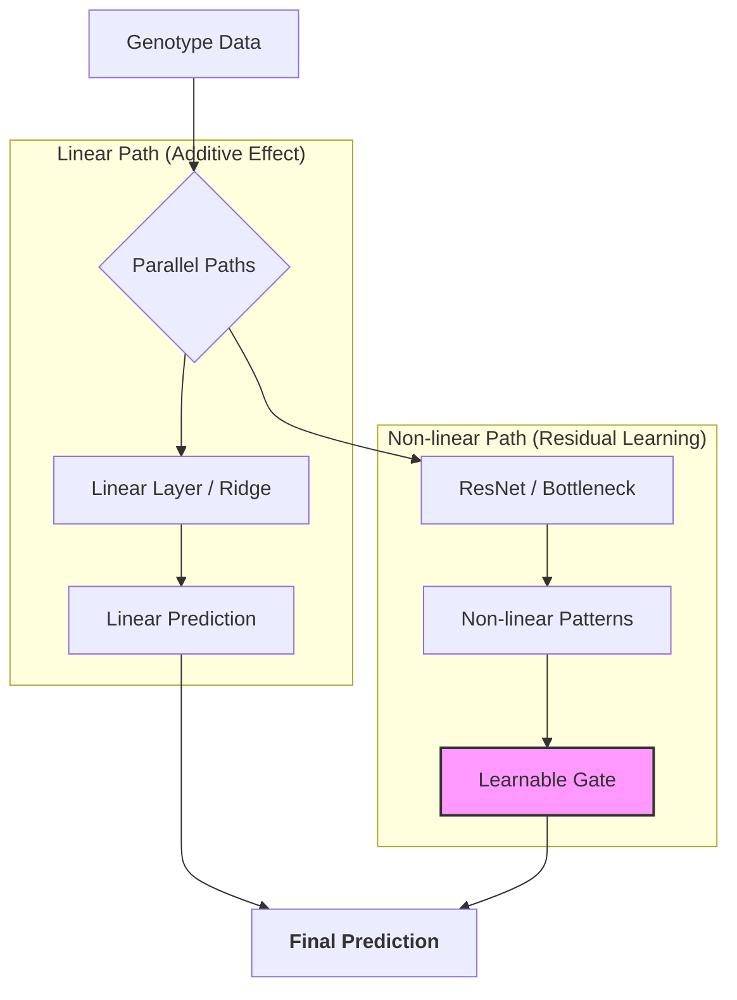

# Genomic-Prediction-ResNet-Hybrid
This is a personal research project focused on deep learning applications in genomic prediction.

## 予測フローの概要



従来のゲノミック予測の線形モデル（GBLUP）と深層学習（ResNet）を統合し、大豆（SoyNAM）のゲノムデータから収量予測を行うハイブリッド・フレームワークです。

## 概要

本プロジェクトは、線形モデル（Ridge/GBLUP）が捉えきれない遺伝子間の非線形な相互作用（エピスタシス等）を、Gated-Residual Learning（ゲート付き残差学習） を用いた ResNet で抽出することを目指しています。

単なるスタッキングではなく、線形成分と非線形成分を同時に最適化（End-to-End）することで、相加的効果を維持しつつ、特定の集団における相乗効果を適応的に取り込むアーキテクチャを採用しています。


## 特徴

- Gated Parallel Architecture: 線形パスと非線形パス（ResNet）を並列に配置。学習可能な Gate Parameter により、非線形シグナルの寄与度を自動調整し、ベースラインの精度崩壊を防ぎます。

- Bottleneck ResNet: 高次元なSNPデータ（4,000+）に対応するため、中間層を一度圧縮するボトルネック構造を採用し、過学習を抑制しながら高次相互作用を抽出。

- Within-Family Standardization: 16家系の環境差を排除するため、家系内標準化による前処理を実装。純粋な遺伝的変異の予測精度を向上。

- W&B Integration: Weights & Biases を活用し、各Foldにおける gate_contribution（ゲートの開き具合）と精度向上（acc_diff）の相関をリアルタイム監視。

## プロジェクト構成

```text
genomic-prediction-resnet-hybrid/
├── data/               # SoyNAM公開表現型・遺伝型データ
├── processed_data_hy/  # preprocess.py によって生成される家系内標準化済みデータ (.npy, .csv)
├── model.py            # GatedGenomicResNet のアーキテクチャ定義
├── main.py             # 並列最適化による学習・検証スクリプト
├── preprocess.py       # 家系統合・標準化・メモリ最適化スクリプト
├── environment.yml     # Conda環境再現用ファイル
└── LICENSE             # MIT License
```
# セットアップ
- 必要条件
Python: 3.9 以上
R: 4.0 以上（sommer パッケージがインストールされていること）

# 手順
- リポジトリをクローン
Bash
git clone [https://github.com/hoso-jpn/genomic-resnet-prediction.git](https://github.com/hoso-jpn/genomic-resnet-prediction.git)
cd genomic-resnet-prediction

- 依存パッケージのインストール
Bash
```text
pip install -r requirements.txt
```

- データの前処理
data/ フォルダ内に各家系のファイルを配置し、以下のスクリプトを実行して統合データセットを作成します。
Bash
```text
python preprocess.py
```

- 実行
Bash
```text
# W&Bにログイン（初回のみ）
wandb login
```

# 実験の開始
```text
python main.py
```

# 今後の展望
- Attention Mechanism: 特定のSNP間の高次相互作用を明示的に抽出するアーキテクチャへの拡張。

- Monetization Analysis: 予測精度の向上が育種コストの削減に与える経済的インパクトの試算。

# ライセンス
- 本プロジェクトは MIT License の下で公開されています。

# データ引用
- 本解析には、SoyNAMプロジェクト（Soybean Nested Association Mapping）より提供された公開データセットを使用しています。
  
# Data Availability
The dataset used in this study is from the SoyNAM project.
Please download the following files from the official source:

- Source URL: https://www.soybase.org/projects/SoyNAM/