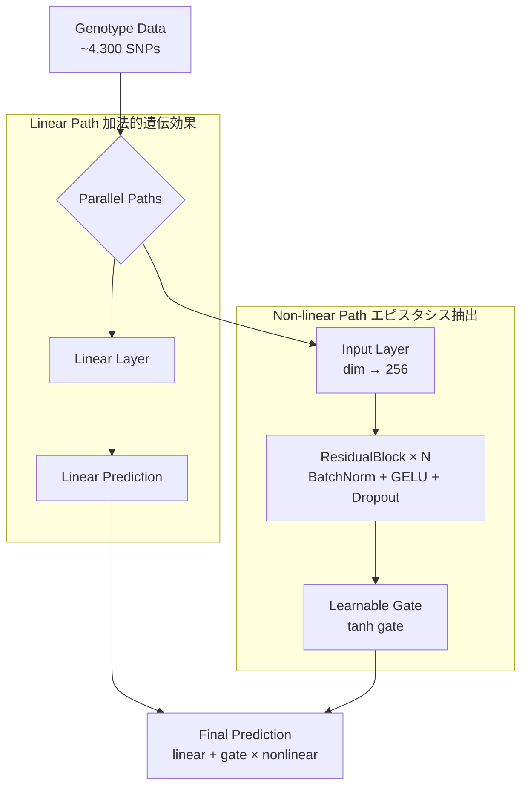

# Genomic-Prediction-ResNet-Hybrid

大豆（SoyNAM）のゲノムデータから収量を予測する深層学習フレームワーク。  
線形モデル（Ridge/GBLUP）と ResNet を Gated Parallel Architecture で統合し、加法的遺伝効果と非線形エピスタシスを同時に学習します。

## アーキテクチャ


```mermaid
graph TD
    A[Genotype Data\n~4,300 SNPs] --> B{Parallel Paths}

    subgraph "Linear Path  加法的遺伝効果"
        B --> C[Linear Layer]
        C --> D[Linear Prediction]
    end

    subgraph "Non-linear Path  エピスタシス抽出"
        B --> E[Input Layer\ndim → 256]
        E --> F[ResidualBlock × N\nBatchNorm + GELU + Dropout]
        F --> G[Learnable Gate\ntanh gate ]
    end

    D --> H[Final Prediction\nlinear + gate × nonlinear]
    G --> H
```

**出力式**: `ŷ = W_lin·x + tanh(g) × ResNet(x)`

- **Linear Path**: RR-BLUP 相当の加法的効果を学習
- **ResNet Path**: ボトルネック構造で高次元SNPを圧縮し非線形相互作用を抽出
- **Gate Parameter**: 非線形パスの寄与度を適応的に制御。`tanh(g) → 0` のとき線形モデルに退縮

## 特徴

- **Within-Family Standardization**: 16家系の環境差を排除し、純粋な遺伝的変異を学習
- **Leave-One-Family-Out CV (LOFO)**: 未知家系への汎化性を評価する最厳格なCV戦略
- **W&B Sweep 対応**: Bayesian 最適化 + Hyperband による自動ハイパーパラメータ探索
- **Docker 対応**: R (sommer) を含む全依存関係をコンテナで再現

## プロジェクト構成

```text
genomic-prediction-resnet-hybrid/
├── data/                  # SoyNAM 公開遺伝型・表現型データ（16家系）
├── processed_data_hy/     # preprocess.py が生成する標準化済みデータ
├── model.py               # GatedGenomicResNet アーキテクチャ定義
├── main.py                # LOFO-CV 学習・評価スクリプト
├── preprocess.py          # 家系統合・標準化・SNPフィルタリング
├── utils.py               # GBLUP ベースライン計算（R/sommer 使用）
├── sweep_config.yaml      # W&B Sweep ハイパーパラメータ探索設定
├── Dockerfile             # Python 3.12 + R 環境
├── docker-compose.yml     # 前処理・学習・Sweep 用サービス定義
├── requirements.txt       # Python 依存パッケージ
└── .env.example           # 環境変数テンプレート（WANDB_API_KEY, SWEEP_ID）
```

## セットアップ

### 前提条件

- Docker および Docker Compose
- W&B アカウント（[wandb.ai](https://wandb.ai) で無料作成可）

### 手順

```bash
# 1. リポジトリをクローン
git clone https://github.com/hoso-jpn/genomic-resnet-prediction.git
cd genomic-resnet-prediction

# 2. 環境変数ファイルを作成
cp .env.example .env
# .env を編集し WANDB_API_KEY を設定（https://wandb.ai/authorize で取得）

# 3. Docker イメージをビルド（R + sommer + PyTorch を含む）
docker compose build

# 4. データの前処理
docker compose run --rm preprocess

# 5. 学習の実行
docker compose run --rm train          # CPU
docker compose run --rm train-gpu      # GPU（NVIDIA Container Toolkit が必要）
```

## W&B Sweep によるハイパーパラメータ探索

Bayesian 最適化で以下のパラメータを自動探索します。

| パラメータ | 範囲 | 説明 |
|---|---|---|
| `hidden_dim` | 128 / 256 / 512 | ResNet の隠れ層次元 |
| `num_blocks` | 2 / 3 / 4 | 残差ブロック数 |
| `dropout_rate` | 0.2 〜 0.5 | Dropout 率 |
| `lr` | 5e-6 〜 1e-3 | 学習率（対数スケール） |
| `l2_reg` | 5e-3 〜 0.2 | L2 正則化強度（対数スケール） |
| `batch_size` | 32 / 64 | バッチサイズ |

```bash
# Sweep を登録（SWEEP_ID が発行される）
docker compose run --rm sweep-init

# .env の SWEEP_ID を更新後、エージェントを起動（30試行で自動停止）
docker compose run --rm sweep-agent
```

W&B ダッシュボードの **Parallel Coordinates Plot** で各パラメータと `summary/mean_hybrid` の関係を可視化できます。

## 評価指標

| 指標 | 説明 |
|---|---|
| `summary/mean_hybrid` | LOFO 全フォールド平均 Pearson 相関係数（主指標） |
| `summary/mean_linear` | 線形パスのみの平均相関係数（ベースライン） |
| `summary/improvement` | hybrid − linear（ResNet の寄与量） |
| `gate_contribution` | `tanh(gate)` の値（非線形パスの開き具合） |

LOFO-CV は未知家系への外挿を評価するため、通常の k-fold より低い値になります。SoyNAM 収量データでは `r ≈ 0.1〜0.3` が実用的な水準です。

## 今後の展望

- **マルチタスク学習**: 収量・登熟日数・タンパク質含量の同時予測によるバックボーン強化
- **Attention Mechanism**: SNP 間の高次相互作用を明示的に抽出するアーキテクチャへの拡張
- **GBLUP ベースライン比較**: `utils.py` の R/sommer 連携による厳密な線形ベースライン評価

## データ引用

本解析には SoyNAM プロジェクト（Soybean Nested Association Mapping）の公開データセットを使用しています。

- Source: [https://www.soybase.org/projects/SoyNAM/](https://www.soybase.org/projects/SoyNAM/)

## ライセンス

[MIT License](LICENSE)
