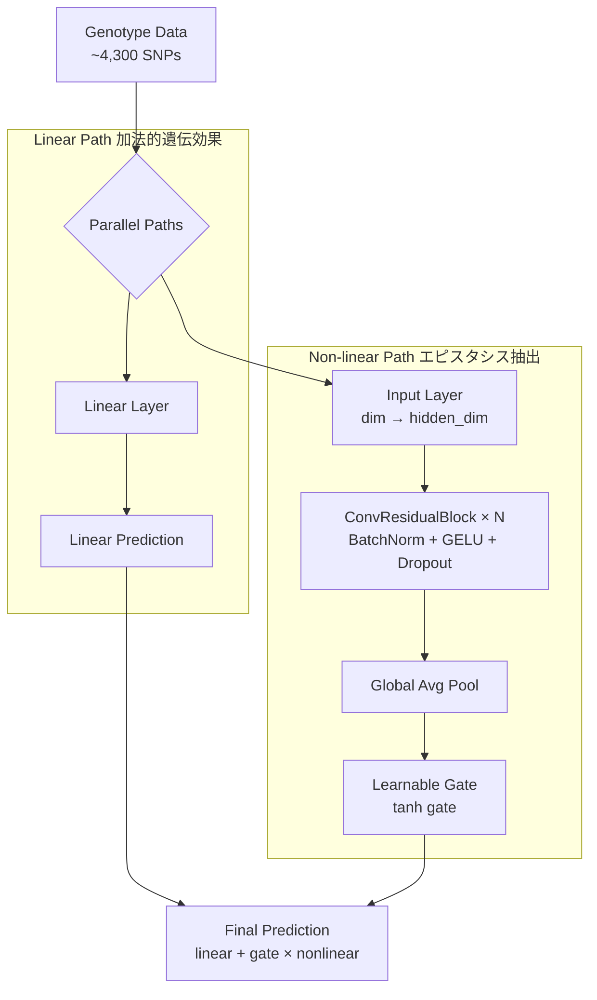
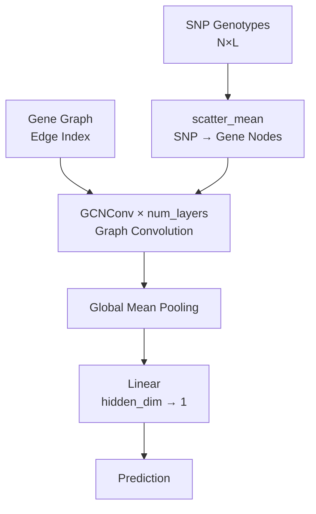

# Genomic-Prediction-ResNet-Hybrid

大豆（SoyNAM）のゲノムデータから収量を予測する深層学習フレームワーク。  
線形モデル（Ridge/GBLUP）と ResNet を Gated Parallel Architecture で統合し、さらに遺伝子グラフ上のメッセージパッシングを行う GNN モデルを追加実装しました。

## モデルアーキテクチャ

### 1. GatedGenomicResNet（`main.py`）

線形パスと 1D CNN ResNet パスをゲート機構で統合するハイブリッドモデル。


```mermaid
graph TD
    A[Genotype Data\n~4,300 SNPs] --> B{Parallel Paths}

    subgraph "Linear Path  加法的遺伝効果"
        B --> C[Linear Layer]
        C --> D[Linear Prediction]
    end

    subgraph "Non-linear Path  エピスタシス抽出"
        B --> E[Input Layer\ndim → hidden_dim]
        E --> F[ConvResidualBlock × N\nBatchNorm + GELU + Dropout]
        F --> G[Global Avg Pool]
        G --> H[Learnable Gate\ntanh gate]
    end

    D --> I[Final Prediction\nlinear + gate × nonlinear]
    H --> I
```

**出力式**: `ŷ = W_lin·x + tanh(g) × ResNet(x)`

- **Linear Path**: RR-BLUP 相当の加法的効果を学習
- **ResNet Path**: 1D 畳み込み残差ブロックで高次元SNPを圧縮し非線形相互作用を抽出
- **Gate Parameter**: 非線形パスの寄与度を適応的に制御。`tanh(g) → 0` のとき線形モデルに退縮

### 2. GraphGenomicNet（`train_gnn.py`）

SNPを遺伝子グラフのノードに集約し、GCN（Graph Convolutional Network）でメッセージパッシングを行う GNN モデル。


```mermaid
graph TD
    A[SNP Genotypes\nN×L] --> B[scatter_mean\nSNP → Gene Nodes]
    C[Gene Graph\nEdge Index] --> D[GCNConv × num_layers\nGraph Convolution]
    B --> D
    D --> E[Global Mean Pooling]
    E --> F[Linear\nhidden_dim → 1]
    F --> G[Prediction]
```

- **SNP→Gene 集約**: 各SNPを対応する遺伝子ノードへ `scatter_mean` で集約
- **GCN**: 遺伝子ネットワーク上でノード特徴量を近傍伝播
- **バッチ処理**: N 個体を一括処理するため edge_index をインデックスオフセットで拡張

## プロジェクト構成

```text
genomic-prediction-resnet-hybrid/
├── data/                          # SoyNAM 公開遺伝型・表現型データ（16家系）
├── processed_data_hy/             # 標準化済みデータ・グラフデータ
│   ├── X_genotype_int8.npy        # SNP 遺伝子型行列
│   ├── y_phenotype_hy.csv         # 表現型（収量）・家系ID
│   ├── snp_to_gene_map.csv        # SNP → 遺伝子マッピング
│   └── gene_adj.csv               # 遺伝子間隣接リスト（無向グラフ）
├── pretrained_models/             # CNN 事前学習済み重み
├── model.py                       # GatedGenomicResNet + GraphGenomicNet 定義
├── main.py                        # ResNet LOFO-CV 学習・評価スクリプト
├── train_gnn.py                   # GNN LOFO-CV 学習・評価スクリプト
├── preprocess.py                  # 家系統合・標準化・SNPフィルタリング
├── create_dummy_graph_data.py     # グラフデータ（ダミー）生成スクリプト
├── create_dummy_pretrained_weights.py  # 事前学習済み重み（ダミー）生成スクリプト
├── gblup_baseline.py              # GBLUP ベースライン（R/sommer 使用）
├── sweep_config.yaml              # W&B Sweep ハイパーパラメータ探索設定
├── Dockerfile                     # Python 3.11 + R 環境
├── docker-compose.yml             # 前処理・学習・Sweep 用サービス定義
├── requirements.txt               # Python 依存パッケージ
└── .env.example                   # 環境変数テンプレート（WANDB_API_KEY, SWEEP_ID）
```

## セットアップ

### ローカル環境（venv）

Python 3.12 / Ubuntu 24.04 での動作を確認しています。

```bash
# 1. リポジトリをクローン
git clone https://github.com/hoso-jpn/genomic-prediction-resnet-hybrid.git
cd genomic-prediction-resnet-hybrid

# 2. 仮想環境を作成・有効化
python3 -m venv .venv
source .venv/bin/activate

# 3. PyTorch（CPU 版）をインストール
pip install torch==2.2.1 --index-url https://download.pytorch.org/whl/cpu

# 4. 残りの依存パッケージをインストール
pip install -r requirements.txt
```

> **Note**: `torch_scatter` は使用していません。SNP→遺伝子集約は純 PyTorch の `scatter_add_` で実装されており、OS/Python バージョンによるバイナリ互換性問題を回避しています。

### Docker 環境

```bash
# 1. 環境変数ファイルを作成
cp .env.example .env
# .env を編集し WANDB_API_KEY を設定（https://wandb.ai/authorize で取得）

# 2. Docker イメージをビルド（R + sommer + PyTorch を含む）
docker compose build

# 3. データの前処理
docker compose run --rm preprocess

# 4. 学習の実行
docker compose run --rm train          # CPU
docker compose run --rm train-gpu      # GPU（NVIDIA Container Toolkit が必要）
```

## 実行方法

### ResNet モデル（GatedGenomicResNet）

```bash
# W&B ログあり（本番）
python main.py

# グラフデータの準備
python create_dummy_graph_data.py        # 擬似グラフデータを生成
python create_dummy_pretrained_weights.py  # 擬似事前学習済み重みを生成
```

### GNN モデル（GraphGenomicNet）

```bash
# グラフデータが必要（create_dummy_graph_data.py で生成済みであること）
python train_gnn.py
```

## W&B Sweep によるハイパーパラメータ探索

Bayesian 最適化で以下のパラメータを自動探索します（ResNet モデル）。

| パラメータ | 範囲 | 説明 |
|---|---|---|
| `hidden_dim` | 128 / 256 / 512 | ResNet の隠れ層次元 |
| `num_blocks` | 2 / 3 / 4 | 残差ブロック数 |
| `dropout_rate` | 0.2 〜 0.5 | Dropout 率 |
| `lr` | 5e-6 〜 1e-3 | 学習率（対数スケール） |
| `l2_reg` | 5e-3 〜 0.2 | L2 正則化強度（対数スケール） |
| `batch_size` | 32 / 64 | バッチサイズ |

```bash
# Sweep を登録（SWEEP_ID が発行される）
docker compose run --rm sweep-init

# .env の SWEEP_ID を更新後、エージェントを起動（30試行で自動停止）
docker compose run --rm sweep-agent
```

## 評価指標

| 指標 | 説明 |
|---|---|
| `summary/mean_hybrid` | LOFO 全フォールド平均 Pearson 相関係数（主指標） |
| `summary/mean_linear` | 線形パスのみの平均相関係数（ベースライン） |
| `summary/improvement` | hybrid − linear（ResNet の寄与量） |
| `gate_contribution` | `tanh(gate)` の値（非線形パスの開き具合） |

LOFO-CV は未知家系への外挿を評価するため、通常の k-fold より低い値になります。SoyNAM 収量データでは `r ≈ 0.1〜0.3` が実用的な水準です。

## 今後の展望

- **GNN ハイパーパラメータ探索**: `train_gnn.py` への W&B Sweep 統合
- **生物学的グラフの導入**: ランダムグラフに代わる実際の遺伝子共発現ネットワークの使用
- **ResNet + GNN ハイブリッド**: 両モデルのアンサンブルによる精度向上
- **マルチタスク学習**: 収量・登熟日数・タンパク質含量の同時予測

## データ引用

本解析には SoyNAM プロジェクト（Soybean Nested Association Mapping）の公開データセットを使用しています。

- Source: [https://www.soybase.org/projects/SoyNAM/](https://www.soybase.org/projects/SoyNAM/)

## ライセンス

[MIT License](LICENSE)
